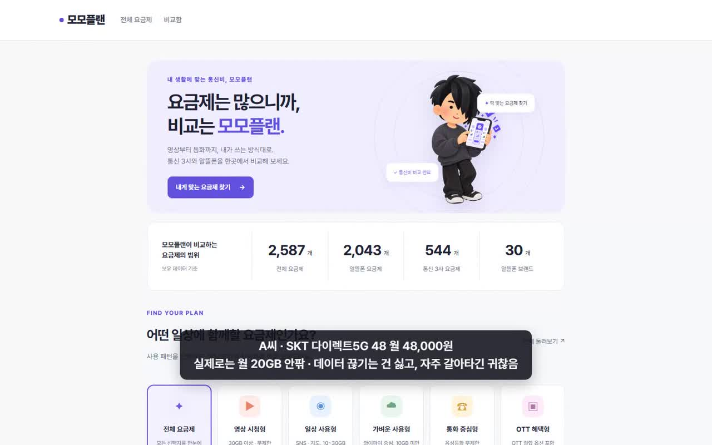
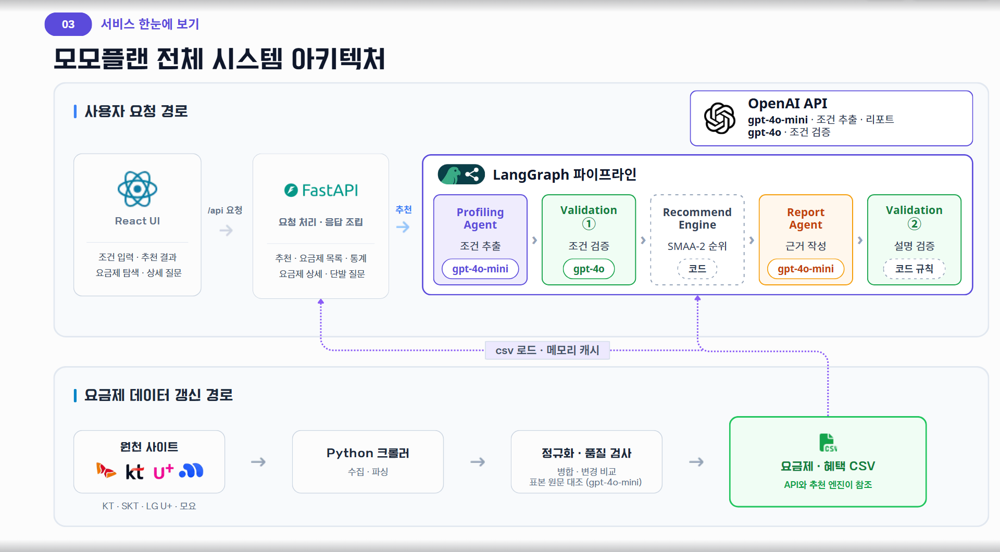

# 모모플랜 브로드밴드

<p align="center">
  
</p>

자연어로 말한 사용량과 예산, 원하는 혜택을 실제 통신 요금제 데이터와 연결해 맞춤 요금제를 추천하는 웹 서비스입니다. 통신 3사와 알뜰폰 요금제를 한곳에서 탐색·비교할 수 있으며, 추천 결과는 요금제 Top 3와 선택 근거, 현재 요금제 대비 12개월 비용 변화로 제공합니다.

> ASAC 빅데이터 분석가 11기 브로드밴드 최종 프로젝트 · 2026.07–2026.09<br>
> [최종 발표 자료](https://www.canva.com/design/DAHVOQJsDFw/r9zDLZfINRgZP4tsivcnjw/view?utm_content=DAHVOQJsDFw&utm_campaign=designshare&utm_medium=link2&utm_source=uniquelinks&utlId=h0c9ea10961)

## 프로젝트 개요

| 항목 | 내용 |
|---|---|
| 목표 | 복잡한 통신 요금제 탐색과 변경 의사결정 지원 |
| 주요 사용자 | 통신비를 줄이거나 현재 요금제를 변경하려는 사용자 |
| 데이터 | 2026-09-22 수집본 기준 2,587개 요금제 |
| 수집 범위 | SKT·KT·LG U+ 및 모요에 등록된 알뜰폰 30개 브랜드 |
| 추천 결과 | 조건에 맞는 요금제 Top 3, 추천 이유, 현재 요금제 대비 비용 변화 |
| 서비스 추천 방식 | 하드 필터링 + 지식 기반 SMAA-2 + 회귀계수 기반 가중치 |
| 비용 비교 기준 | 할인 기간을 반영한 12개월 총비용 |

## 서비스 시연

웹 서비스 시연 영상입니다.

<p align="center">
  <a href="./docs/assets/demo/momoplan-demo.mp4">
    
  </a>
</p>

<p align="center">
  <strong>이미지를 클릭하면 시연 영상이 열립니다.</strong><br>
  <a href="./docs/assets/demo/momoplan-demo.mp4">시연 영상 직접 열기</a>
</p>

## 팀 구성 및 역할

| 팀원 | 역할 | 담당 |
|---|---|---|
| [이종선](https://github.com/karls-seon) (팀장) | PM | 서비스 기획·일정 관리, 추천 범위와 기준 결정 |
| [김민재](https://github.com/bonggu0102) | AI Engineer | LLM 에이전트 설계, 조건·리포트·설명 검증 |
| [김주영](https://github.com/kimjuyoung011124) | Data Engineer | 데이터 수집·정제·검증, 사용자 프로파일링 |
| [김찬결](https://github.com/cksruf5130-gif) | Data Scientist | 추천 알고리즘 설계 |
| [조승근](https://github.com/jo-seunggeun) | Data Analyst | 평가 지표·테스트셋 설계, 추천 결과 분석 |

Mentor: 채진영

## 문제 정의

통신 요금제는 기본 데이터, 소진 후 속도, 통화·문자, 테더링, 할인 기간과 OTT 혜택처럼 비교해야 할 조건이 많습니다. 같은 ‘무제한’ 표현도 실제 제공량과 QoS 속도에 따라 체감이 다르고, 단기 할인가만 보면 장기 비용을 잘못 판단할 수 있습니다.

모모플랜은 다음 과정을 하나의 서비스로 연결했습니다.

1. 자연어 대화에서 예산과 사용량, 필수 조건과 선호 조건을 구분합니다.
2. 조건을 만족하지 않는 요금제를 먼저 제외합니다.
3. 남은 후보를 가격·데이터·QoS·혜택·통화·테더링 기준으로 평가합니다.
4. 추천 이유와 12개월 비용 차이를 생성하고, 설명에 잘못된 금액이나 과장된 표현이 없는지 검증합니다.

## 주요 기능

### 전체 요금제 탐색

- 통신사, 월 요금, 데이터 제공량, 통화, 네트워크, 혜택 필터
- 카드·표 보기 및 가격·데이터 기준 정렬
- 요금제 상세 정보와 할인 종료 후 요금 확인

### 요금제 비교

- 여러 요금제를 비교함에 담아 한 화면에서 비교
- 다른 항목만 보기
- 최저 비용과 첫 번째 상품 대비 차이 표시
- 할인 기간을 반영한 12개월 총비용 비교

### AI 맞춤 추천

- “월 3만 원 이하, 데이터 100GB 이상”과 같은 자연어 조건 해석
- 현재 요금제와 사용 패턴을 반영한 전환 가치 판단
- 필수 조건이 부족하면 임의 추천 대신 추가 질문
- 추천 요금제 Top 3와 선택 근거 리포트 제공

### 추천 설명 검증

- 사용자 발화와 추출 조건을 다시 대조
- 추천 카드의 요금과 비용 차이 검증
- 속도 보장이나 위약금처럼 데이터로 확인할 수 없는 표현 차단
- 검증 실패 시 리포트를 한 번 수정하고 문제가 남으면 해당 문장 제거

## 전체 아키텍처

 전체 시스템 아키텍처입니다.

<p align="center">
  
</p>

### 추천 파이프라인

추천 파이프라인은 다음 순서로 동작합니다.

```text
profiling → profile_check → recommend → report → evaluation
```

- `profiling`: 자연어 대화에서 사용자 조건 추출
- `profile_check`: 추출한 조건을 실제 사용자 발화와 대조
- `recommend`: 하드 필터링과 SMAA-2로 후보 평가
- `report`: 추천 이유와 현재 요금제 대비 변화 생성
- `evaluation`: 결과 문장의 금액·방향·과장 표현 검증

## 추천 알고리즘

세 가지 방식을 같은 요금제 후보군에서 비교했으며, 실제 서비스에는 지식 기반 추천을 적용했습니다.

| 방식 | 구현 | 설명 | 적용 위치 |
|---|---|---|---|
| 협업 필터링 | `agent/segmentation.py` | 합성 가입 이력을 KMeans 세그먼트로 나누고 세그먼트별 인기 요금제를 추천 | 비교 실험 |
| 콘텐츠 기반 | `agent/cosine_recommendation.py` | 사용자 요구 벡터와 요금제 속성 벡터의 코사인 유사도 계산 | 비교 실험 |
| 지식 기반 | `agent/data.py`, `agent/mcda.py` | 필수 조건으로 후보를 거른 뒤 SMAA-2로 다기준 순위 계산 | 실제 서비스 |

### 서비스에 적용한 지식 기반 추천

1. 예산, 데이터, 통화, 혜택 등 명시적인 필수 조건으로 후보를 필터링합니다.
2. 가격·데이터·QoS·혜택·통화·테더링 효용을 0~1 범위로 계산합니다.
3. 실제 알뜰폰 가입 데이터의 Ridge 표준화 계수를 300회 부트스트랩한 가중치 표본을 사용합니다.
4. 각 표본에서 후보 순위를 계산해 1위 수용도, 기대 순위, Top 3 안정성을 구합니다.
5. 내부 상위 후보 중 최종 Top 3를 화면에 표시합니다.

문자는 통화 무제한과 강하게 겹쳐 별도 가중치 축에서 제외했습니다. 사용자가 특정 기준을 우선한다고 말하면 해당 축의 가중치를 높이되, 하나의 기준이 전체 결정을 독점하지 않도록 상한을 둡니다.

## 데이터 수집 및 갱신

`crawler/src/`에서 SKT, KT, LG U+, 모요 데이터를 수집합니다.

```text
수집 → 파싱 → 스키마 검증 → 통합 → 이전 데이터와 변경 비교 → 검증 → 서비스 반영
```

- 사이트별 크롤러를 별도 프로세스로 실행해 한 사이트의 오류가 다른 수집에 영향을 주지 않도록 했습니다.
- 전체 행 수 급변, 특정 사이트 데이터 급감, 중복 ID 등 이상 징후가 있으면 갱신을 중단합니다.
- 크롤링 결과는 먼저 `crawler/data/`에 저장되며, 검증 후 `--promote`를 실행해야 서비스용 `data/`에 반영됩니다.
- 추천 서비스는 고정된 CSV를 읽기 때문에 크롤링 중 데이터가 바뀌어 추천 결과가 흔들리지 않습니다.

## 추천 알고리즘 평가

가상 질문 100개에 대해 각 알고리즘의 상위 5개를 생성한 뒤 LLM이 알고리즘 이름을 보지 않고 평가했습니다. 실제 화면은 상위 3개를 제공합니다.

| 방식 | Precision@5 | Hit@1 | 조건 위반 ↓ | 더 나은 대안 없음 ↑ |
|---|---:|---:|---:|---:|
| 협업 필터링: 세그먼트별 인기 요금제 | 19.0% | 27.0% | 68.8% | 4.5% |
| 콘텐츠 기반: 코사인 유사도 | 18.0% | 19.0% | 61.0% | 1.9% |
| 지식 기반: SMAA-2 무작위 가중치 | 51.6% | 56.0% | 10.3% | 62.3% |
| **지식 기반: SMAA-2 + 회귀계수** | **47.4%** | **68.0%** | **10.1%** | **62.9%** |

최종 방식은 상위 5개 전체 적중률보다 사용자가 먼저 보는 1순위의 정확도를 우선해 선택했습니다. `data/eval/test_cases_정답지.xlsx`를 사용하는 규칙 기반 Precision/Recall 평가는 이 발표 평가와 별개의 과거 평가입니다.

## 기술 스택

| 구분 | 기술 |
|---|---|
| Frontend | React 19, TypeScript, Vite |
| Backend | Python, FastAPI, Uvicorn |
| Agent | LangGraph, LangChain, OpenAI API |
| Recommendation | Pandas, NumPy, scikit-learn, SMAA-2, Ridge bootstrap |
| Data Collection | Requests, BeautifulSoup, Selenium |
| Data | CSV, JSON, Excel |

## 저장소 구조

```text
├── agent/                 # LLM 에이전트와 추천 알고리즘
│   ├── agents/            # profiling, recommend, report, evaluation
│   ├── graph.py           # LangGraph 파이프라인
│   ├── data.py            # 데이터 로드와 하드 필터링
│   ├── mcda.py            # SMAA-2 랭킹
│   ├── segmentation.py    # 협업 필터링 비교 실험
│   └── cosine_recommendation.py
├── backend/               # FastAPI 서버와 요금제 API
├── frontend/              # React + Vite 웹 화면
├── crawler/src/           # 통신 3사·모요 수집 및 검증
├── data/                  # 서비스용 CSV, 기준 데이터, 평가 데이터
├── experiments/           # 추천 방식 비교와 평가 스크립트
├── notebooks/             # EDA와 회귀 가중치 분석
├── outputs/               # 분석 노트와 비교 지표
├── requirements.txt
└── test_service_process.py
```

## 실행 방법

이 프로젝트는 Colab이나 Jupyter Notebook이 아니라 로컬에서 백엔드와 프런트엔드를 각각 실행하는 웹 애플리케이션입니다.

### 1. 실행 환경

- Python 3.11 권장
- Node.js 20 LTS 권장
- OpenAI API Key

### 2. 저장소 복제 및 Python 환경 구성

```bash
git clone https://github.com/ASAC11broadband/telecom-plan-recommendation.git
cd telecom-plan-recommendation

python -m venv .venv
```

Windows PowerShell:

```powershell
.\.venv\Scripts\Activate.ps1
python -m pip install --upgrade pip
pip install -r requirements.txt
```

macOS/Linux:

```bash
source .venv/bin/activate
python -m pip install --upgrade pip
pip install -r requirements.txt
```

### 3. 환경변수 설정

저장소 루트에 `.env` 파일을 만들고 API Key를 입력합니다.

```dotenv
OPENAI_API_KEY=your_openai_api_key

# 선택 설정: 지정하지 않으면 아래 기본값 사용
PROFILE_MODEL=gpt-4o-mini
REPORT_MODEL=gpt-4o-mini
EVAL_MODEL=gpt-4o
LLM_CALLS_PER_MINUTE=20
```

`.env`는 Git에 커밋하지 않습니다. 요금제 탐색·필터·비교는 저장된 CSV로 동작하지만, 자연어 추천과 요금제 질문 기능에는 OpenAI API Key가 필요합니다.

### 4. 백엔드 실행

첫 번째 터미널에서 저장소 루트를 기준으로 실행합니다.

```bash
uvicorn backend.main:app --reload --host 127.0.0.1 --port 8000
```

정상 실행 확인:

- Health Check: http://127.0.0.1:8000/api/health
- API 문서: http://127.0.0.1:8000/docs

### 5. 프런트엔드 실행

두 번째 터미널에서 실행합니다.

```bash
cd frontend
npm install
npm run dev
```

브라우저에서 http://localhost:5173 에 접속합니다. Vite가 `/api` 요청을 `http://127.0.0.1:8000`으로 전달하므로 별도 CORS 설정은 필요하지 않습니다.

백엔드를 다른 주소나 포트에서 실행할 때는 프런트 실행 전에 `API_TARGET`을 지정합니다.

```powershell
$env:API_TARGET="http://127.0.0.1:8001"
npm run dev
```

### 6. 프로덕션 빌드 확인

```bash
cd frontend
npm run build
npm run preview
```

## 크롤러 실행

크롤링은 웹 서비스 실행에 필수는 아닙니다. 저장된 데이터 대신 최신 데이터를 다시 수집하려는 경우에만 실행합니다.

```bash
cd crawler

# 네 사이트 수집부터 통합·검증까지 실행
python src/refresh_plans.py

# 기존 캐시로 파싱·비교만 실행
python src/refresh_plans.py --parse-only

# 검증된 크롤러 최종본을 서비스용 data/에 반영
python src/refresh_plans.py --promote
```

`--promote`는 서비스가 읽는 CSV를 변경하므로 크롤링 검증 결과를 확인한 뒤 실행해야 합니다.

## 주요 API

| 메서드 | 경로 | 설명 |
|---|---|---|
| GET | `/api/health` | 서버 상태 확인 |
| GET | `/api/stats` | 전체 요금제 및 필터별 건수 |
| GET | `/api/plans` | 검색·필터·정렬·페이지네이션 |
| GET | `/api/plans/{id}` | 요금제 상세 조회 |
| POST | `/api/recommend` | 대화 기반 요금제 추천과 리포트 생성 |
| POST | `/api/ask` | 특정 요금제에 대한 질문 |
| GET | `/api/analysis` | 데이터 분석 요약 |
| POST | `/api/analysis/ask` | 요금제 데이터 분석 질문 |

## 테스트 및 자체 점검

```bash
# 백엔드·추천 서비스 회귀 테스트
python -m unittest test_service_process

# 주요 모듈 자체 점검
python -m agent.data
python -m agent.mcda
python -m agent.agents.report
python -m agent.agents.evaluation
python -m backend.plans

# 프런트엔드 타입 검사와 빌드
cd frontend
npm run build
```

추천 방식 비교 실험은 저장소 루트에서 실행합니다.

```bash
python -m experiments.run_segment_test
python -m experiments.run_cosine_test
python -m experiments.run_metric_table
python -m experiments.weight_scale_check
```

## 한계와 향후 과제

- 회귀 가중치는 모요 가입자 선택 데이터를 기반으로 하므로 모요 이용자 성향과 노출 효과가 포함될 수 있습니다.
- 현재 평가는 가상 시나리오와 자동 채점 기반이며 실제 사용자의 선택과 만족도를 검증하지 못했습니다.
- 서비스 배포 후 추천 클릭, 상세 조회, 비교함 추가와 전환 데이터를 수집해 가중치를 다시 추정할 필요가 있습니다.
- 통신 3사 데이터는 온라인 전용 요금제 중심이라 일부 오프라인 요금제를 이름으로 찾지 못할 수 있습니다.
- 통신사 웹페이지 구조가 바뀌면 크롤러 파서와 스키마 검증 규칙을 함께 갱신해야 합니다.

## 참고 문서

- [`experiments/README.md`](experiments/README.md): 실험·평가 스크립트 설명
- [`HANDOFF.md`](HANDOFF.md): 현재 정책값과 구현 결정 이력
- [`outputs/분석노트/`](outputs/분석노트/): 추천 방식과 전처리 근거
- [최종 발표 자료](https://www.canva.com/design/DAHVOQJsDFw/r9zDLZfINRgZP4tsivcnjw/view?utm_content=DAHVOQJsDFw&utm_campaign=designshare&utm_medium=link2&utm_source=uniquelinks&utlId=h0c9ea10961)
